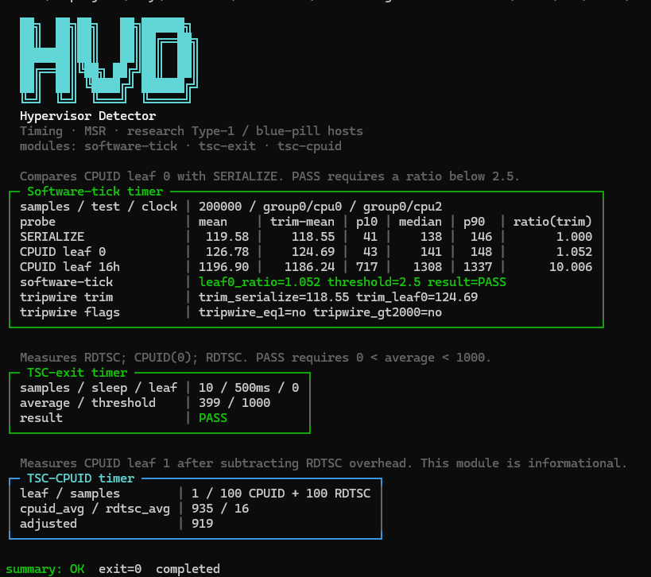

# HvD ( Development )



**HvD** (Hypervisor Detector) is a **usermode** (and planned **kernelmode**) harness for research Type-1 / blue-pill hypervisors on Windows x64.

---

## Measurements 

| Flag | Module | What it measures | Gate |
| --- | --- | --- | --- |
| `--software-tick` | Software-tick timer | Cross-core shared counter: `SERIALIZE` vs `CPUID` leaf 0 (optional leaf 16h; optional VMCALL) | **PASS** if `leaf0_ratio < 2.5` |
| `--tsc-exit` | TSC-exit timer | `RDTSC; CPUID(0); RDTSC` × 10, `Sleep(500)` between samples | **PASS** if `0 < average < 1000` |
| `--tsc-cpuid` | TSC-CPUID timer | Leaf **1**: 100× sandwich + 100× RDTSC-pair overhead → `adjusted` | **Informational** (no public standard threshold) |
| `--vmcall` | (with software-tick) | Optional VMCALL floor probe | Report only |
| `--plain` |  | Text framing, no color |  |
| `--all` |  | All modules (default if no module flag) |  |


### Example

```text
hvd.exe
hvd.exe 200000 --software-tick --tsc-exit
hvd.exe --tsc-cpuid --plain
hvd.exe --all --vmcall
```

---

## Exit codes

| Code | Meaning |
| --- | --- |
| **0** | All gated modules that ran **PASS**; no setup errors |
| **1** | At least one gated module **FAIL** (threshold); no setup errors |
| **2** | Invalid CLI |
| **3** | Insufficient CPU topology (e.g. software-tick needs two physical cores) |
| **4** | Test-thread affinity / priority setup failed |
| **5** | Software-tick clock-thread setup failed |
| **6** | Required CPU capability unavailable (e.g. no `SERIALIZE`) |
| **7** | Required probe raised an exception |

Setup errors (**2+**) override gated failures (**1**). Selected modules continue after a module-local setup failure when possible.

---

## References 

HvD mirrors **public and reverse-engineered** detector patterns. Thresholds are taken from those sources where they are explicit; others stay informational until calibrated.

### 1. Software-tick timer from [VMAware](https://github.com/kernelwernel/VMAware) `VM::TIMER`

- Dual-thread **software clock** (shared cache line), **not** RDTSC.
- Compares latency of an exiting instruction (`CPUID`) to a non-exit reference (`SERIALIZE` / multi-`LFENCE` on non-Intel paths in VMAware).
- Default ratio threshold: **`latency_ratio >= 2.5` → detect** (raised only on Hyper-V *host* paths in VMAware; HvD uses **2.5** unless extended).
- Secondary fingerprints in VMAware (not hard-gated in HvD v1): `best == 1` or `best > 2000` (counter freeze / IPI-style pause).

HvD module: **`--software-tick`** → gate **`leaf0_ratio < 2.5`**.

### 2. TSC-exit timer from [Pafish](https://github.com/a0rtega/pafish) `cpu_rdtsc_force_vmexit`

From `pafish/cpu.c`:

```c
// RDTSC; CPUID leaf 0; RDTSC  with 10 samples, Sleep(500) between
// PASS if 0 < average < 1000
```

HvD module: **`--tsc-exit`** → gate **`0 < average < 1000`**, leaf **0**, 10 samples, 500 ms sleep.

### 3. TSC-CPUID timer from EAC-style kernel routine (reversed)
EAC use a **quiet-window leaf-1** sandwich with RDTSC overhead subtraction. A reversed sketch of the measurement core:

```c
// Conceptual reconstruction of MeasureCpuidRdtscTiming-style logic

SavedIrql = KeGetCurrentIrql();
__writecr8(0xF);   // HIGH_LEVEL

// 100×  RDTSC; CPUID(EAX=1); RDTSC
for (i = 0; i < 100; i++) {
    t0 = __rdtsc();
    __cpuid(..., 1);   // leaf 1
    t1 = __rdtsc();
    sum_cpuid += (t1 - t0);
}

// 100×  RDTSC; RDTSC  (overhead)
for (i = 0; i < 100; i++) {
    t0 = __rdtsc();
    t1 = __rdtsc();
    sum_rdtsc += (t1 - t0);
}

__writecr8(SavedIrql);
// adjusted ≈ (sum_cpuid/100) - (sum_rdtsc/100)
// threshold / scoring is not determined yet. if you know the threshold or the scoring routine you can dm me on discord
```


## Roadmap (kernel / MSR)

Planned modules :

| Probe | Source class | Notes |
| --- | --- | --- |
| APERF / MPERF around CPUID | MSR timing / IET | Needs ring 0 `RDMSR`; pin + quiet IRQL |
| INVD / WBINVD emulation | Instruction handling | Privileged; many thin HVs stub poorly |
| Other MSR probes | Synthetic / invalid MSR, TSC MSR | Policy-dependent intercepts |
| Kernel leaf-1 TSC-CPUID | EAC-style above | Same math as usermode, quieter environment |

## Layout

```text
HvD/
  include/     headers
  src/         main.cpp, modules, ops.asm
  static/      images
  build/bin/   HvD.exe (after build)
  HvD.sln
  HvD.vcxproj
  README.md
```

## Build

Visual Studio 2022 + MSVC (v143), Windows SDK 10.0+ recommended.

```text
msbuild HvD.sln /m /p:Configuration=Release /p:Platform=x64
```

Output: `build\bin\HvD.exe`.
