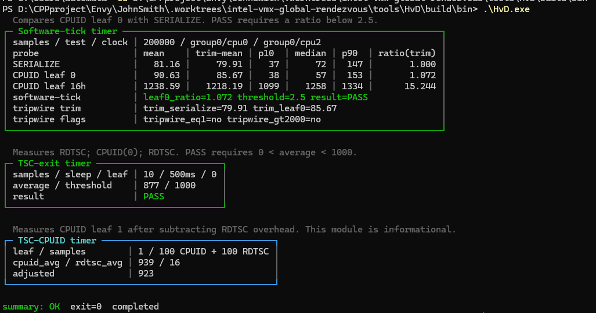

# HvD ( Development )

HvD is a Hypervisor Detector in Both Usermode and Kernelmode to make sure it is hypervisor or not 

## Measurements

- `--software-tick` compares CPUID against SERIALIZE using a counter thread on another physical core.
- `--tsc-exit` samples CPUID latency with pauses between measurements.
- `--tsc-cpuid` reports CPUID cost after subtracting RDTSC overhead.
- `--vmcall` adds an optional VMCALL probe. Unsupported hypervisors are reported without crashing the process.
- and soon many such as APERF-CPUID MPERF, INVD emu and other msr probing 

## Exit codes

- `0`: completed without a failed gate
- `1`: a timing gate failed
- `2`: invalid command-line arguments
- `3` or greater: setup or probe failure

## Notes

Timing results depend on CPU topology, firmware, power management, background load, and the active hypervisor. Compare repeated runs under the same conditions.