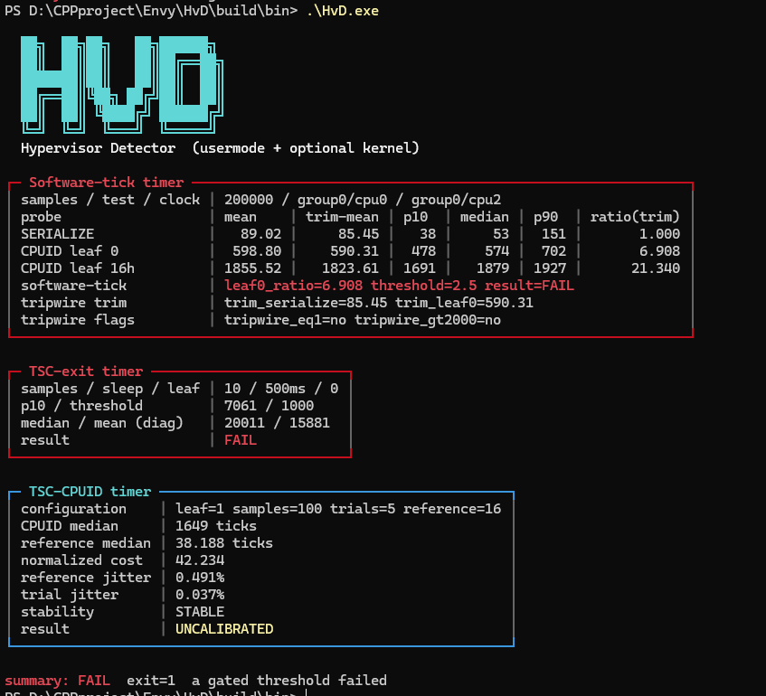
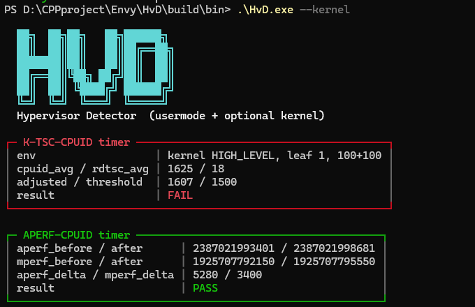

# HvD (Development)

Usermode

Kernel


**HvD** (Hypervisor Detector) is a modular **usermode + optional kernel** harness for research Type-1 / blue-pill hypervisors on Windows x64.

---

## Measurements (usermode)

| Flag | Module | What it measures | Gate |
| --- | --- | --- | --- |
| `--software-tick` | Software-tick timer | Cross-core counter: SERIALIZE vs CPUID leaf 0 | **PASS** if `leaf0_ratio < 2.5` |
| `--tsc-exit` | TSC-exit timer | `RDTSC; CPUID(0); RDTSC` × 10, Sleep(500) between | **PASS** if `0 < average < 1000` |
| `--tsc-cpuid` | TSC-CPUID timer | Leaf 1 versus paired block reference, normalized ratio | Reports stability and calibration state |
| `--vmcall` | (with software-tick) | Optional VMCALL floor | Report only |
| `--all` | | All **usermode** modules (default) | |
| `--plain` | | Text framing, no color | |

## Measurements (kernel, need to load the driver first)

| Flag | Module | What it measures | Gate |
| --- | --- | --- | --- |
| `--k-tsc-cpuid` | K-TSC-CPUID timer | EAC-style: pin + HIGH_LEVEL, leaf 1, 100+100, `adjusted` | **PASS** if `0 < adjusted < 1500` (same research bar; re-validate on kernel) |
| `--aperf-cpuid` | APERF-CPUID timer | APERF/MPERF around CPUID(1) | **FAIL** if APERF delta == 0 |
| `--invd` | INVD-emulation check | WBINVD / write / INVD coherence | **FAIL** if value looks emulated |
| `--kernel` | | All kernel modules | |

Device: `\\.\HvD`. Driver missing → setup code **8** (other modules still run).  
See [`driver/README.md`](driver/README.md).

### Example

```text
HvD.exe
HvD.exe 200000 --software-tick --tsc-exit
HvD.exe --tsc-cpuid --plain
HvD.exe --all --vmcall
HvD.exe --kernel
HvD.exe --k-tsc-cpuid --aperf-cpuid --invd
```

---

## Exit codes

| Code | Meaning |
| --- | --- |
| **0** | All gated modules that ran **PASS**; no setup errors |
| **1** | At least one gated module **FAIL** (threshold); no setup errors |
| **2** | Invalid CLI |
| **3** | Insufficient CPU topology |
| **4** | Test-thread affinity / priority setup failed |
| **5** | Software-tick clock-thread setup failed |
| **6** | Required CPU capability unavailable |
| **7** | Required probe raised an exception |
| **8** | Kernel probe driver not loaded (`\\.\HvD`) |

Setup errors (**2+**) override gated failures (**1**).

---

## References

### 1. Software-tick ← [VMAware](https://github.com/kernelwernel/VMAware) `VM::TIMER`

- Dual-thread software clock (not RDTSC).
- Ratio threshold **2.5** (HvD default).

### 2. TSC-exit ← [Pafish](https://github.com/a0rtega/pafish) `cpu_rdtsc_force_vmexit`

- Leaf 0, 10 samples, Sleep(500), **average < 1000**.

### 3. Usermode TSC-CPUID

- 20 ms non-yielding warmup.
- 100 paired leaf-1/reference samples, with a 16-read reference block.
- Median-of-5 normalized `adjusted_ratio` plus reference/trial MAD diagnostics.
- Informational until a CPU-model and VBS-state calibration dataset exists.

### 4. K-TSC-CPUID ← EAC-style kernel routine

Quiet-window leaf-1 sandwich (HIGH_LEVEL in kernel path):

```c
// Conceptual reconstruction of MeasureCpuidRdtscTiming-style logic
SavedIrql = KeGetCurrentIrql();
__writecr8(0xF);   // HIGH_LEVEL

for (i = 0; i < 100; i++) {
    t0 = __rdtsc();
    __cpuid(..., 1);   // leaf 1
    t1 = __rdtsc();
    sum_cpuid += (t1 - t0);
}
for (i = 0; i < 100; i++) {
    t0 = __rdtsc();
    t1 = __rdtsc();
    sum_rdtsc += (t1 - t0);
}
__writecr8(SavedIrql);
// adjusted ≈ avg_cpuid - avg_rdtsc
// public threshold not known from reverse sketch — kernel module is info-only
```

### 5. APERF / INVD

- APERF/MPERF: MSR IET-style checks around exiting instructions.
- INVD: classic WBINVD/INVD coherence fingerprint for thin HVs.

---
